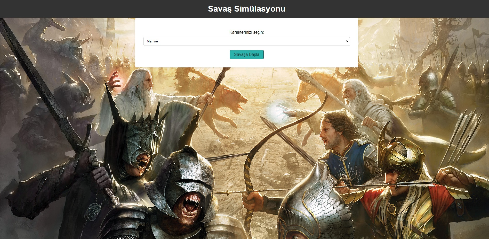
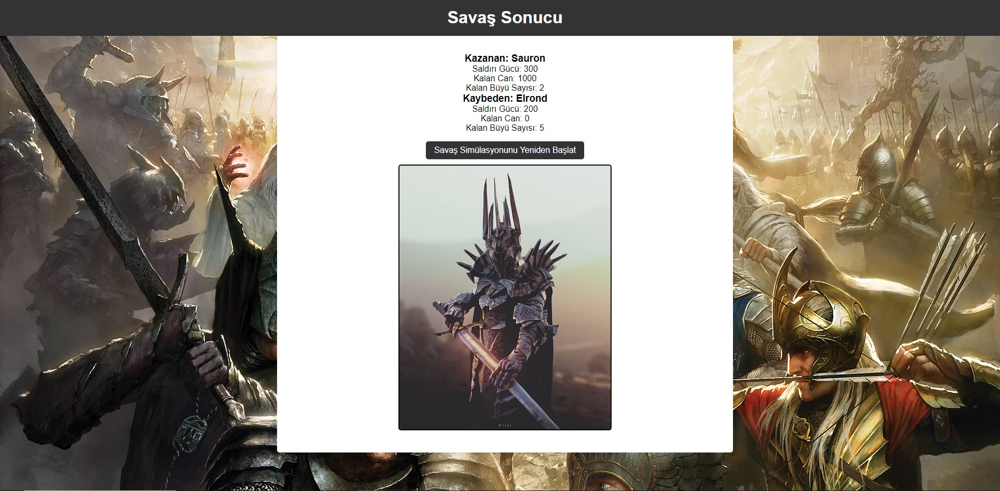

# Yüzüklerin Efendisi Minimal Savaş Simülasyonu
Python fonksiyonlarını, Flask framework'ünü ve HTML-CSS kodlarını kullanarak; Orta Dünya karakterlerinden birini seçip istediğiniz bir düşmanla savaştırabileceğiniz, kazananın da görselini görebileceğiniz, minimal bir savaş simülasyonu yaptım. Arayüz tasarımında ortada yer alan yüzük kinetiktir, yani etrafında dönmektedir. 

