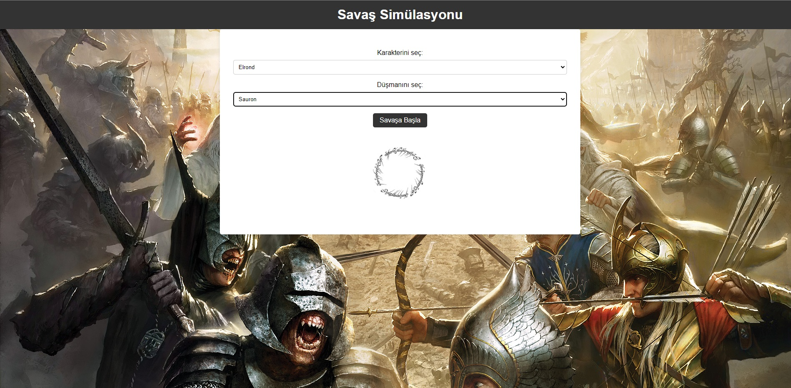

# Yüzüklerin Efendisi Minimal Savaş Simülasyonu
Python fonksiyonları, Flask framework'ü ve HTML-CSS kodlarını kullanarak; Orta Dünya karakterlerinden birini seçip istediğiniz bir düşmanla savaştırabileceğiniz, kazananın da görselini görebileceğiniz, minimal bir savaş simülasyonu yaptım. Arayüz tasarımında ortada yer alan yüzük kinetiktir.

# Lord of the Rings Minimal Battle Simulation
Using Python functions, Flask framework and HTML-CSS codes; I made a minimal war simulation in which you can choose one of the Middle Earth characters, have them fight any enemy you want, and see the visual of the winner. The ring in the middle of the interface design is kinetic.

